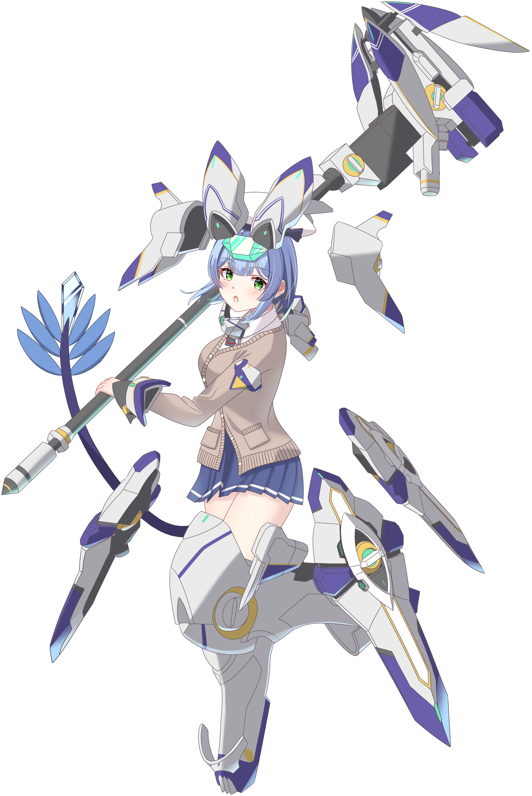
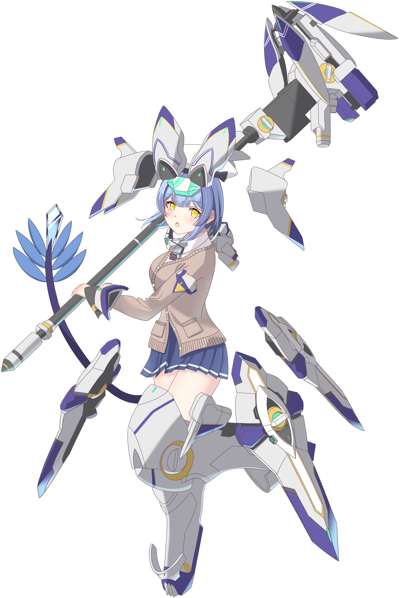
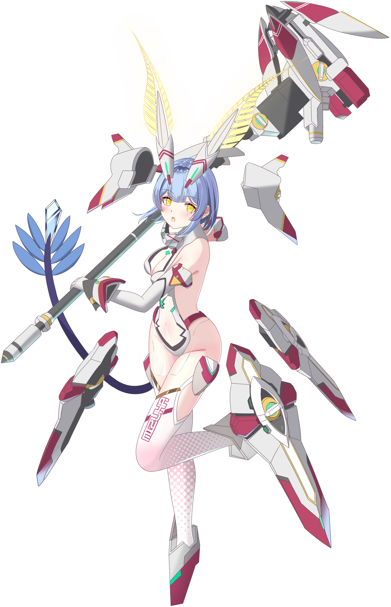

# キャラクター画像

楠木瑞羽の立ち絵一覧です。

---

## 戦闘服　─　ワンピース＋剣持ち

{ .chara-img }

龍神雷牙より授けられた大剣を携えた戦闘形態。  
普段の制服姿とは打って変わる、凛々しい一面。

---

## 制服①　─　セーラー服（春夏）

{ .chara-img }

春夏の制服。さわやかなセーラーカラーが特徴。

---

## 制服②　─　ブレザー

Live2D モデルとポーズ違いの2枚。

{ .chara-img }

{ .chara-img }

---

## 星の翼　─　ハルカ＆サタニア風コスプレ

『星の翼』というゲームにおける私の一番のメインキャラ、**ハルカ**（および**サタニア**）風のコスプレイラスト集。  
初プレイのときからずっと共に戦い抜いてきた思い入れの深いキャラクターたち。

左：ハルカ　／　右：サタニア

{ .chara-img }

{ .chara-img }

{ .chara-img }

{ .chara-img }

{ .chara-img }

{ .chara-img }

{ .chara-img }

{ .chara-img }

{ .chara-img }

{ .chara-img }

{ .chara-img }

{ .chara-img }

---

## SD

{ .chara-img }

---

## おやすみ

{ .chara-img }

おやすみなさい⭐

