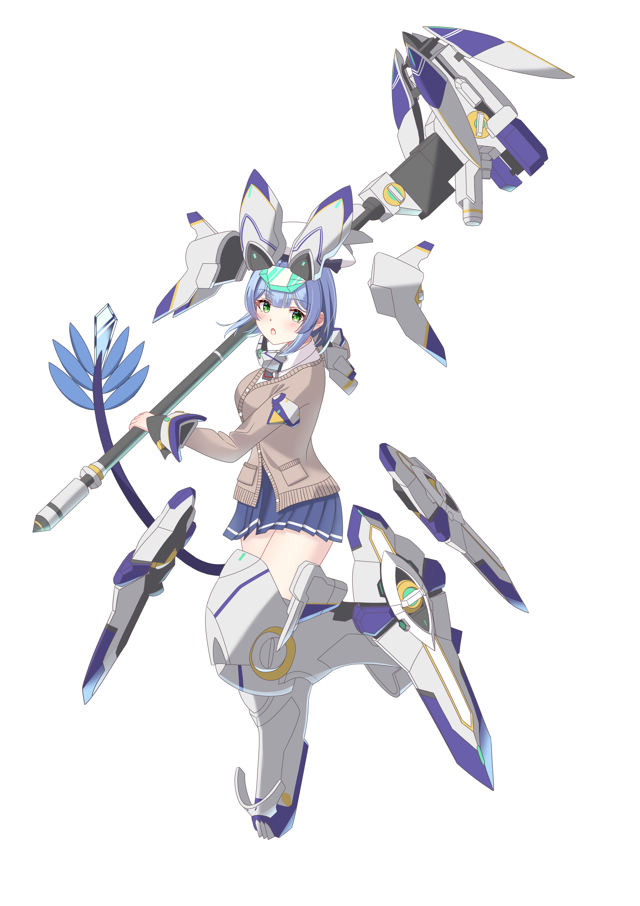

# キャラクター画像

楠木瑞羽の立ち絵一覧です。

---

## 戦闘服　─　ワンピース＋剣持ち

{ .chara-img }

龍神雷牙より授けられた大剣を携えた戦闘形態。  
普段の制服姿とは打って変わる、凛々しい一面。

---

## 制服①　─　セーラー服（春夏）

{ .chara-img }

春夏の制服。さわやかなセーラーカラーが特徴。

---

## 制服②　─　ブレザー

Live2D モデルとポーズ違いの2枚。

{ .chara-img }

{ .chara-img }

---

## 星の翼　─　ハルカ風コスプレ

{ .chara-img }

『星の翼』初プレイのときからずっと共に戦い抜いてきた、ハルカ風の衣装。  
アクションゲームということで「使用した」という表現が正しいかもしれないが、それだけ思い入れの深い一着。  
現在、**強化形態**および**サタニア**風コスプレの差分も鋭意制作中。続報をお楽しみに！

---

## SD

{ .chara-img }

---

## おやすみ

{ .chara-img }

おやすみなさい⭐

