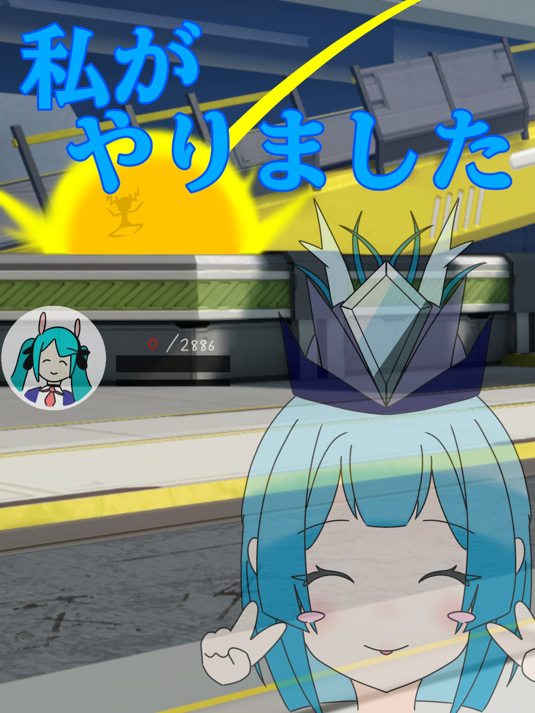

# ファンアートギャラリー

リューメイトの皆さんからいただいたファンアートを紹介しています 🩵  
タグ [`#みずはーと`](https://x.com/search?q=%23%E3%81%BF%E3%81%9A%E3%81%AF%E3%83%BC%E3%81%A8) でポストしていただいた作品を掲載しています。

---

<!--
【追加方法】
以下のブロックをコピーして必要な数だけ増やしてください。

  
  

    <a href="https://x.com/【作者のXID】" target="_blank" rel="noopener">@【作者のXID】</a>
  

画像ファイルは docs/img/fanart/ フォルダに入れてください。
-->

<!-- FANART_START -->

  
  

    1/2<a href="https://x.com/munouyaku_desu" target="_blank" rel="noopener">@munouyaku_desu</a>
  

  
  

    2/2<a href="https://x.com/munouyaku_desu" target="_blank" rel="noopener">@munouyaku_desu</a>
  

  
  

    <a href="https://x.com/tottchiki2619" target="_blank" rel="noopener">@tottchiki2619</a>
  

<!-- FANART_END -->

