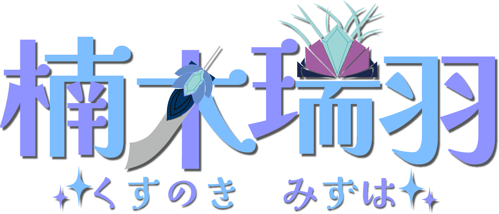
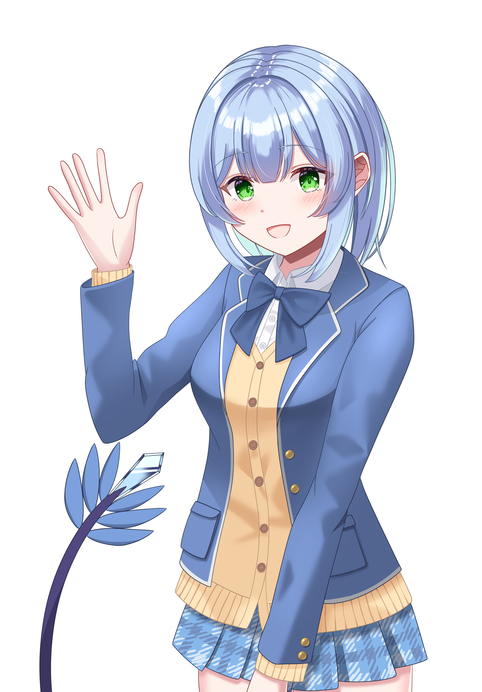

{ .hero-logo }

**Vtuber ✦ Individual**

---

## プロフィール

| | |
|---|---|
| 名前 | 楠木瑞羽（くすのき みずは） |
| 肉体年齢 | 17歳 |
| 身長 | 161cm |
| 体重 | 48kg |
| スリーサイズ | B88(Fカップ) / W58 / H84 |
| 気質 | インドア派 |
| 所属 | パソコン部 |
| 得意分野 | 理系科目全般・PC・ソフトウェア開発 |
| 好きなもの | ロボットアニメ・メカ系コンテンツ全般 |
| 性的趣向 | 女性が好き |

※バ美肉ボイチェンおじさん

---

## キャラクター紹介

楠木瑞羽の正体は、かつてとあるIT企業に勤めていた成人男性エンジニアである。

男子高校を経て都内の国立理工系大学大学院修士課程を修了し、ソフトウェア開発の上流から下流まで一通りこなす、ごく普通の社会人だった。

ある日、神社を訪れた際に**悪霊の襲撃**を受け、死の淵に立たされる。その危機的状況の中で**龍神・龍神雷牙（りゅうじんらいがー）**と邂逅し、百邪を払う力を授けられた。
しかしその代償として、肉体・社会的立場ともに**女子高生へと変貌**することになった。

---

## 性格・内面

「中身は元のまま男のままだ」と本人は主張しているが、思考回路・知識・価値観のベースには前世のエンジニア時代の色が色濃く残っている。ロボットアニメやメカ系コンテンツへの情熱は女体化後も微塵も衰えていない。

一人称は「私」。元々成人として使い慣れていたため抵抗はないが——気づけば心の中の声が「俺」から「私」に変わっている。本人はまったく気づいていない。

日常の細かい立ち振る舞いや感情表現が、じわじわと女子高生らしくなってきているのを周囲は感じているが、本人は頑として認めない。それはそれで一つのアイデンティティになりつつあるようだ。

---

## 戦闘・能力

龍神雷牙より授けられた力により、**大剣の召喚・行使**が可能。この大剣は二つの戦闘形態を持つ多機能な霊装である。

=== "近接形態"

    通常時の形態。召喚された大剣をそのまま振るい、百邪を力強く斬り払う。
    普段の温和な佇まいからは想像しがたい、豪快な戦いぶりを見せる。

=== "射撃形態"

    大剣の刀身が複数に展開・変形し、**砲身**として機能する形態へ移行する。
    収束した魔力が**氷・水晶系の魔力弾**となって放たれ、アウトレンジからの精密射撃を可能にする。
    水晶の魔力弾はその美しさとは裏腹に、命中した悪霊を一瞬で封じる強力な浄化の力を宿している。

---

## 配信について

前世の記憶とスキルはそのままに、女子高生として第二の人生を歩みながら Vtuber として活動中。
ゲーム実況・雑談など幅広く配信しています。
早い話がバ美肉ボイチェンおじさんなわけですが、その要素を最大限生かせるようなキャラ設定を意識しています。
バ美肉ボイチェンであることはご理解願います。

[:fontawesome-brands-youtube: YouTube チャンネルへ](https://www.youtube.com/@楠木瑞羽){ .md-button .md-button--primary }
[:fontawesome-brands-x-twitter: 配信告知 X](https://x.com/Mizuha_live){ .md-button }
